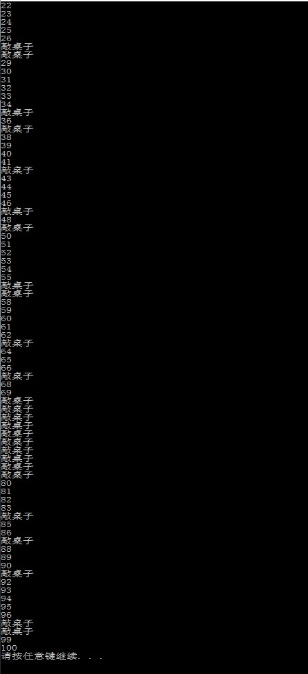
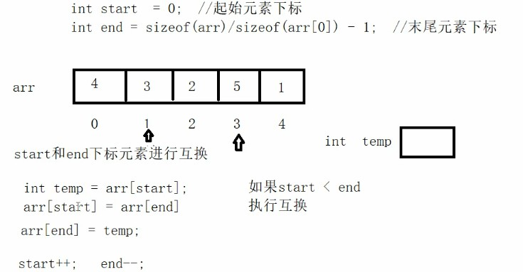
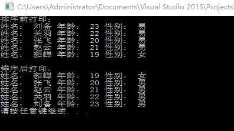

# C++学习

----------------

# day01

# 1 C++初识

## 1.1 hello world

```C++
#include <iostream>
using namespace std;
int main()
{
    cout << "hello world!" << endl;
    system("pause");
    return 0;
}
```

`system("pause")`是使窗口暂停，不出现闪退。

## 1.2 注释

`//`是单行注释符

`/* */`是多行注释符

## 1.3 变量

变量存在的意义：方便我们管理内存空间

变量创建的语法：`数据类型 变量名=变量初始值;`

变量的作用：给一段指定的内存空间起名，方便操作这段内存

## 1.4 常量

作用：用于记录程序中不可更改的数据

1. **#define**宏常量：`#define 宏常名 常量值`

   通常在文件上方定义，表示一个常量

2. **const**修饰的变量`const 数据类型 常量名=常量值`

   通常在变量定义前加关键字const，修饰该变量为常量，不可修改

## 1.5 关键字

作用：关键字是C++中预先保留的单词（标识符）

**在定义变量或者常量时候，不要用关键字，否则会产生歧义**

## 1.6 标识符命名规则

作用：C++规定给标识符（变量、常量）命名时，有一套自己的规则

- 标识符不能是关键字
- 标识符只能由字母、数字、下划线组成
- 第一个字符必须为字母或下划线
- 标识符中字母区分大小写

# 2 数据结构

数据类型存在的意义：给变量分配合适的内存空间

C++规定在创建一个变量或者常量时，必须要指出相应的数据类型，否则无法给变量分配内存

## 2.1 整形

作用：整型变量表示的是证书类型的数据

| 数据类型            | 占用空间                                            | 取值范围     |
| ------------------- | --------------------------------------------------- | ------------ |
| short(短整型)       | 2字节                                               | -2^15-2^15-1 |
| int(整型)           | 4字节                                               | -2^31-2^31-1 |
| long(长整型)        | Windows为4字节，Linux为4字节（32位），8字节（64位） | -2^31-2^31-1 |
| long long(长长整型) | 8字节                                               | -2^63-2^63-1 |

**区别在于所占内存空间不同**

## 2.2 sizeof关键字

作用：利用sizeof关键字可以统计数据类型所占内存大小

语法：`sizeof(数据类型/变量)`

## 2.3 实型（浮点型）

作用：用于表示小数

分类：

- 单精度`float`
- 双精度`double`

| 数据类型 | 占用空间 | 有效数字范围    |
| -------- | -------- | --------------- |
| float    | 4字节    | 7位有效数字     |
| double   | 8字节    | 15~16位有效数字 |

**科学计数法**

```C++
float f = 3e2;//3*10^2=300
float f1 = 4e-2;//4*10^-2=0.04
```

## 2.4 字符型

作用：字符变量用于显示单个字符

语法：`char ch = 'a';`

**注意：**在显示字符型变量时，用单引号将字符括起来，不要用双引号，单引号内只能有一个字符，不可一世字符串

C/C++中字符型变量只占用**一个字节**，字符型变量并不是把字符本身放到内存中存储，而是将对应的ASCII编码放入到存储单元中

## 2.5 转义字符

作用：用于表示一些不能显示出来的ASCII字符

常用的转义字符：

| 转义字符 | 含义                           | ASCII（十进制） |
| -------- | ------------------------------ | --------------- |
| \n       | 换行，将当前位置移到下一行开头 | 010             |
| \t       | 水平制表                       | 009             |
| \\       | 代表一个反斜杠字符“\”          | 092             |

## 2.6 字符串型

作用：用于表示一串字符

两种风格：

- C风格字符串：`char 变量名[] = "字符串值";`
- C++风格字符串：`string 变量名 = "字符串值";`

## 2.7 布尔类型 bool

作用：不二数据类型代表真或假的值

bool类型只有两个值：

- true --真（本质是1）
- false --假（本质是0）

bool类型占1个字节大小

## 2.8 数据输入

作用：用于从键盘获取数据

关键字：`cin`

语法：`cin >> 变量`

代码地址：[https://github.com/smallpotatody/C-_learning/tree/master/code](https://github.com/smallpotatody/C-_learning/tree/master/code)

--------------------------------------------------

# day02

# 3 运算符s

作用：用于执行代码的运算

| 运算符类型 | 作用                                   |
| ---------- | -------------------------------------- |
| 算术运算符 | 用于处理四则运算                       |
| 赋值运算符 | 用于将表达式的值赋给变量               |
| 比较运算符 | 用于表达式的比较，并返回一个真值或价值 |
| 逻辑运算符 | 用于根据表达式的值返回真值或假值       |


## 3.1 算术运算符

作用：用于处理四则运算

算术运算符包括以下符号：

| 运算符 | 术语          | 示例     | 结果  |
| ------ | ------------- | -------- | ----- |
| +      | 正号\|加      | +3\|10+5 | 3\|15 |
| -      | 负号\|减      | -3\|10-7 | -3\|3 |
| *      | 乘            | 10*5     | 50    |
| /      | 除            | 10/5     | 2     |
| %      | 取摸（取余）  | 10%3     | 1     |
| ++     | 前置/后置递增 | ++a/a++  | a+1/a |
| --     | 前置/后置递减 | --a/a--  | a-1/a |

两个小数之间是不可以进行取模（取余）运算，只有整形变量可以取模运算

## 3.2 赋值运算符

作用：用于将表达式的值赋给变量

| 运算符 | 术语   | 示例      | 结果     |
| ------ | ------ | --------- | -------- |
| =      | 赋值   | a=2;b=3;  | a=2;b=3; |
| +=     | 加等于 | a=0;a+=2; | a=2;     |
| -=     | 减等于 | a=3;a-=2; | a=1;     |
| *=     | 乘等于 | a=2;a*=4; | a=8;     |
| /=     | 除等于 | a=4;a/=2; | a=2;     |
| %=     | 模等于 | a=3;a%2;  | a=1;     |


## 3.3 比较运算符

作用：用于表达式的比较，并返回一个真值或假值

| 运算符 | 术语     | 示例 | 结果 |
| ------ | -------- | ---- | ---- |
| ==     | 相等于   | 4==3 | 0    |
| !=     | 不等于   | 4!=3 | 1    |
| <      | 小于     | 4<3  | 0    |
| >      | 大于     | 4>3  | 1    |
| <=     | 小于等于 | 4<=3 | 0    |
| >=     | 大于等于 | 4>=3 | 1    |

在使用`cout <<(a==b)<<endl;`时，必须加括号

## 3.4 逻辑运算符

作用：用于根据表达式的值返回真值或假值

| 运算符 | 术语 | 示例     | 结果                                                   |
| ------ | ---- | -------- | ------------------------------------------------------ |
| !      | 非   | !a       | 如果a为假，则a为真；如果a为真，则a为假。               |
| &&     | 与   | a&&b     | 如果a和b都为真，则结果为真，否则为假。                 |
| \|\|   | 或   | a \|\| b | 如果a和b有一个为真，则结果为真，二者都为假，结果为假。 |

# 4 程序流程结构

C/C++支持最基本的三种程序运行结构：顺序结构、选择结构、循环结构

- 顺序结构：程序按顺序执行，不发生跳转
- 选择结构：依据条件是否满足，有选择的执行相应的功能
- 循环结构：依据条件是否满足，循环多次执行某段代码

## 4.1 选择结构

### 4.1.1 if语句

作用：执行满足条件的语句

if语句的三种形式:

- 单行格式if语句

  `if(条件){条件满足执行语句}`

- 多行格式if语句

  `if(条件){条件满足执行的语句}else{条件不满足执行的语句}`

- 多条件的if语句

  `if(条件1){条件1满足执行的语句}else if(条件2){条件2满足执行的语句}...else{都不满足执行的语句}`

**嵌套if语句**：在if语句中，可以嵌套使用if语句，达到更精确的条件判断

### 4.1.2  三目运算符

作用：通过三目运算符实现简单的判断

语法：`表达式1?表达式2:表达式3;`

解释：如果表达式1为真，执行表达式2，并返回表达式2的结果；

如果表达式1为假，执行表达式3，并返回表达式3的结果；

### 4.1.3 switch语句

作用：执行多条分支语句

语法：

```C++
switch(表达式)
{
    case 结果1:执行语句;
        break;
     case 结果2:执行语句;
        break;
     ...
     default:执行语句;
        break;
}
```

if和switch区别？
switch缺点，判断时候只能是整型或者字符型，不可以是一个区间

switch有点，结构清晰，执行效率高

case里如果没有break，那么程序会一直向下执行

## 4.2 循环结构

### 4.2.1 while循环语句

作用：满足循环条件，执行循环语句

语法：`while(循环条件){循环语句}`

解释：只要循环的结果为真，就执行循环语句

在执行循环语句时，程序必须提供跳出循环的出口，否则出现死循环

**while循环练习案例：猜数字**

案列描述：系统随机生成一个1到100之间的数字，玩家进行猜测，如果猜错，提示玩家数字过大或过小，如果猜对恭喜玩家胜利，并退出游戏。

```C++
#include <iostream>
using namespace std;
#include <ctime>
int main()
{
	//添加随机数种子，作用利用当前系统时间生成随机数，防止每次随机数一样
	srand((unsigned int)time(NULL));

	//1.系统产生随机数
	int num = 0;
	num = rand() % 100 + 1;
	while (1)
	{
		//2.玩家进行猜测
		int val = 0;
		cin >> val;
		//3.判断玩家猜测
		//猜对 退出游戏
		//猜错 提示猜的结果 过大或过小
		if (val > num)
		{
			cout << "猜测过大" << endl;
		}
		else if (val < num)
		{
			cout << "猜测过小" << endl;
		}
		else
		{
			cout << "恭喜你猜对了" << endl;
			break;//用来退出当前循环
		}
	}
	system("pause");
	return 0;
}
```


思维导图：


代码地址：[https://github.com/smallpotatody/C-_learning/tree/master/day02/code](https://github.com/smallpotatody/C-_learning/tree/master/day02/code)

-------------------------------------------

### 4.2.2 do ...while循环语句

作用：满足循环条件，执行循环语句

语法：`do{循环语句}while(循环条件);`

注意：与while的区别在于do...while会先执行一次循环语句，再判断循环条件

练习案例：水仙花数

水仙花数是指一个三位数，它的每个位上的数字的3次幂之和等于它本身，请利用do...while语句，求出所有3位数字中的水仙花数。

```c++
#include <iostream>
using namespace std;
#include <cmath>

int main()
{
	int num = 100;
	int a = 0;
	int b = 0;
	int c = 0;
	int sum = 0;
	cout << "水仙花数有：" << endl;
	do 
	{
		a = num % 10;
		b = num / 10 % 10;
		c = num / 100;
		sum = a*a*a + b*b*b + c*c*c;
		if (sum == num)
		{
			cout << num << endl;
		}
		num++;
	} while (num <= 999);
	system("pause");
	return 0;
}
```

结果：

### 4.2.3 for循环语句

作用：满足循环条件，执行循环语句

语法：`for(起始表达式;条件表达式;末尾循环体){循环语句;}`

练习案例：敲桌子

案列描述：从1开始数到数字100，如果数字个位含有7，或者数字十位含有7，或者该数字是7的倍数，我们打印敲桌子，其余数字直接打印输出。

```c++
#include <iostream>
using namespace std;
#include <cmath>

int main()
{
	for (int i = 1; i <= 100; i++)
	{
		if (i % 10 == 7 || i / 10 == 7 || i % 7 == 0)
		{
			cout << "敲桌子" << endl;
		}
		else
		{
			cout << i << endl;
		}
	}
	system("pause");
	return 0;
}
```

结果：

### 4.2.3 嵌套循环

作用：在循环体中再嵌套一层循环，解决一些实际问题

案例：99乘法口诀表

```C++
#include <iostream>
using namespace std;

int main()
{
	cout << "9X9乘法口诀表" << endl;
	for (int i = 1; i < 10; i++)
	{
		for (int j = 1; j <= i; j++)
		{
			cout << j << " X " << i << " = " << i*j<<"\t" ;
		}
		cout << endl;
	}
	cout << endl;
	cout << endl;
	cout << "99加法表" << endl;
	for (int i = 1; i < 10; i++)
	{
		for (int j = i; j <10; j++)
		{
			cout << i << " + " << j << " = " << i+j << "\t";
		}
		cout << endl;
	}
	system("pause");
	return 0;
}
```

结果：

## 4.3 跳转语句

### 4.3.1 break语句

作用：用于跳出选择结构或者循环结构

break使用时机：

- 出现switch条件语句中，作用是终止case并跳出switch
- 出现循环语句中，作用是跳出当前的循环语句
- 出现在嵌套语句中，跳出最近的内存循环语句

### 4.3.2 continue语句

作用：在循环语句中，跳过本次循环中余下尚未执行的语句，继续执行下一次循环

continue并没有使整个循环终止，而break会跳出循环

### 4.3.3 goto语句

作用：可以无条件跳转语句

语法：`goto 标记;`

解释：如果标记的名称存在，执行到goto语句时，会跳转到标记的位置。

在程序中不建议使用goto语句，以免造成程序流程混乱

# 5. 数组

## 5.1 概述

所谓数组，就是一个集合，里面存放了相同类型的数据元素

特点1：数组中的每个数据元素都是相同的数据类型

特点2：数组由连续的内村位置组成的

## 5.2 一维数组

### 5.2.1 一维数组定义方式

一维数组的三种定义方式：

1. `数据类型 数组名[数组长度];`

2. `数据类型 数组名[数组长度] = {值1，值2 ...}`

   如果在初始化数据的时候，没有全部填写完，会用0来填补剩余数据

3. `数据类型 数组名[] = {值1，值2 ...}`

数组元素的下标是从0开始索引的

### 5.2.2 一维数组组名

用途：

可以统计整个数组在内存中的长度

可以获取数组在内存中的首地址

数组名是一个常量，不可以进行赋值操作

练习案例：五只小猪称体重

案例描述：

在一个数组中记录了五只小猪的体重并打印最重的小猪体重

```C++
#include <iostream>
using namespace std;

int main()
{
	cout << "请输入五只小猪体重：" << endl;
	int arr[5];
	for (int i = 0; i < 5; i++)
	{
		cout << "第" << i+1 <<"只猪的体重为";
		cin >> arr[i];
	}
	int max = 0;
	int j = 0;
	int t = 0;
	for (j = 0; j < 5; j++)
	{
		
		if (arr[j] >= max)
		{
			max = arr[j];
			t = j + 1;
		}
	
	}
	cout << "最大值体重为"<< max << endl;
	cout << "第" << t << "只猪最重" << endl;
	system("pause");
	return 0;
}
```

结果：


案例2：数组元素逆置

案例描述：请声明一个5个元素的数组，并且将元素逆置。



```C++
#include <iostream>
using namespace std;

int main()
{
	//1.创建数组元素逆置
	int arr[5] = {};
	cout << "输入数组元素" << endl;
	for (int k = 0; k < 5; k++)
	{
		cout << "第" << k << "个元素为:";
		cin >> arr[k];
	}
	cout << "转换前的顺序为：";
	for (int i = 0; i < 5; i++)
	{
		cout << arr[i] << " ";
	}
	cout << endl;
	//2.实现逆置
	int start = 0;//起始元素下标
	int end = sizeof(arr) / sizeof(arr[0]) - 1;//结束下标
	while (start < end) 
	{
		int temp = arr[start];
		arr[start] = arr[end];
		arr[end] = temp;
		start++;
		end--;
	}
	//3.打印逆置后的数组
	cout << "转换后的顺序为：";
	for (int j = 0; j < 5; j++)
	{
		cout << arr[j] << " ";
	}
	cout << endl;
	
	system("pause");
	return 0;
}
```

案列结果：


### 5.2.3 冒泡排序

作用：最常用的排序算法，对数组内元素进行排序

1. 比较相邻的元素。如果第一个比第二个大，就交换它们。
2. 对每一对相邻的元素做同样的工作，执行完毕后，找到一个最大值
3. 重复以上步骤，每次比较次数-1，直到不需要比较


## 5.3 二维数组

二维数组就是在一维数组上，多加一个维度

### 5.3.1 二维数组定义方式

- `数据类型 数组名[行数][列数];`
- `数据类型 数组名[行数][列数] = {{数据1，数据2},{数据3,数据4}};`
- `数据类型 数组名[行数][列数] = {数据1，数据2,数据3,数据4};`
- `数据类型 数组名[][列数] = {数据1，数据2,数据3,数据4};`

利用第二种方式更加直观，提高代码可读性

在定义二维数组时，如果初始化了数据，可以省略行数

### 5.3.2 二维数组名

查看二维数组所占内存空间

获取二维数组首地址

### 5.3.3 二维数组应用案例

考试成绩统计：

案例描述：有三名同学（张三，李四，王五），在一次考试中的成绩分别如下表，请分别输出三名同学的总成绩

|      | 语文 | 数学 | 英语 |
| ---- | ---- | ---- | ---- |
| 张三 | 100  | 100  | 100  |
| 李四 | 90   | 50   | 100  |
| 王五 | 60   | 70   | 80   |

```C++
#include <iostream>
using namespace std;
#include <string>
int main()
{
	string names[3] = { "张三","李四","王五" };
	int score[3][3] = 
	{
		{100,100,100},
		{90,50,100},
		{60,70,80}
	};
	for (int i = 0; i < 3; i++)
	{
		int sum = 0;
		for (int j = 0; j < 3; j++)
		{
			sum += score[i][j];
		}
		cout << names[i] << "的总分：" << sum << endl;
	}
	system("pause");
	return 0;
}
```

结果：

---------------------------------------

day04

# 6. 函数

## 6.1 概述

作用：将一般经常使用的代码封装起来，减少重复代码

一个较大的程序，一般分为若干个程序块，每个模块实现特定的功能。

## 6.2 函数的定义

函数的定义一般主要有5个步骤：

1. 返回值类型
2. 函数名
3. 参数列表
4. 函数体语句
5. return表达式

语法：

```C++
返回值类型 函数名 ()
{
    函数体语句;
    return 表达式;
}
```

- 返回值类型：一个函数可以返回一个值，在定义函数时使用
- 函数名：给函数起个名字
- 参数列表：使用该函数时，传入的数据
- 函数体语句：花括号内的代码，函数内需要执行的语句
- return表达式：和返回值类型挂钩，函数执行完后，返回相应的数据

## 6.3 函数的调用

功能：使用定义好的函数*-


语法：`函数名 (参数);`

## 6.4 值传递

值传递：就是函数调用时实参将数值传入给形参

值传递时，如果形参发生改变，并不会影响实参

## 6.5 函数常见样式

1. 无参无返
2. 有参无返
3. 无参有返
4. 有参有返

## 6.6 函数的声明

作用：告诉编译器函数名称及如何调用函数。函数的实际主体可以单独定义。

函数的声明可以多次，但是函数的定义只能有一次

## 6.7 函数的分文件编写

作用：让代码结构更加清晰

函数分文件编写一般有4个步骤

1. 创建后缀名为.h的头文件
2. 创建后缀名为.cpp的源文件
3. 在头文件中写函数的声明
4. 在源文件中写函数的定义

# 7. 指针

## 7.1 指针的基本概念

指针的作用：可以通过指针间接访问内存

- 内存编号是从0开始记录的，一般用十六进制数字表示；
- 可以利用指针变量保存地址；

## 7.2 指针变量的定义和使用

指针变量定义语法：`数据类型 * 变量名;`

## 7.3 指针所占内存空间

在32位操作系统下：不管是什么数据类型，占用4个字节空间；64位下占8个字节。

## 7.4 空指针和野指针

空指针：指针变量指向内存中编号为0的空间

用途：初始化指针变量

注意：空指针指向的内存是不可以访问的 

野指针：指针变量指向非法的内存空间

空指针和野指针都不是我们申请的空间，因此不要访问

## 7.5 const修饰指针

1. const修饰指针   --常量指针

   特点：指针的指向可以修改，但是指针指向的值不可以改

2. const修饰常量    --指针常量

   特点：指针的指向不可以改，指针指向的值可以改

3. const即修饰指针，又修饰常量

   特点：指针的指向和指针指向的值都不可以改

技巧：看const右侧紧跟着的是指针还是常量，是指针就是常量指针，是常量就是指针常量

## 7.6 指针和数组

作用：利用指针访问数组中元素

## 7.7 指针和函数

作用：利用指针做函数参数，可以修改实参的值

总结：如果不想修改实参，就用值传递，如果想修改实参，就用地址传递

## 7.8 指针、数组、函数

案例描述：封装一个函数，利用冒泡排序，实现对整型数组的升序排序

```C++
#include <iostream>
using namespace std;

void bubbleSort(int *arr, int len)
{
	for (int i = 0; i < len - 1; i++)
	{
		for (int j = 0; j < len - 1 - i; j++)
		{
			if (arr[j] > arr[j + 1])
			{
				int temp = arr[j];
				arr[j] = arr[j + 1];
				arr[j + 1] = temp;
			}
		}
	}
}

void printArray(int *arr, int len)
{
	for (int i = 0; i < len; i++)
	{
		cout << arr[i] << endl;
	}
}

int main()
{
	//1.先创建数组
	int arr[10] = { 4,3,6,9,1,2,10,8,7,5 };
	int len = sizeof(arr) / sizeof(arr[0]);
	//2.创建函数，实现冒泡排序
	bubbleSort(arr, len);
	//3.打印排序后的数组
	printArray(arr, len);
	system("pause");
	return 0;
}
```

结果：


-------------------------------

day05

# 8. 结构体

## 8.1 结构体基本概念

结构体属于用户自定义的数据类型，允许用户存储不同的数据类型

## 8.2 结构体定义和使用

语法：`struct 结构体名{结构体成员列表};`

- struct 结构体名 变量名
- struct 结构体名 变量名 = {成员1值, 成员2值...}
- 定义结构体时顺便创建变量

定义结构体时关键字是struct，不可省略

创建结构体变量时，关键字struct可以省略

结构体变量利用操作符 "."访问成员

## 8.3 结构体数组

作用：将自定义的结构体放入到数组中方便维护

语法: `struct 结构体名 数组名[元素个数] = { {}, {}...{} }`

## 8.4 结构体指针

作用：通过指针访问结构体中的成员

利用操作符`->`可以通过结构体指针访问结构体属性

## 8.5 结构体嵌套结构体

作用：结构体的成员可以是另一个结构体

## 8.6 结构体做函数参数

作用：将结构体作为参数向函数中传递

传递方式：

- 值传递
- 地址传递

如果不想修改主函数中的数据，用值传递，反之用地址传递

## 8.7 结构体中const使用场景

作用：用const来防止误操作

## 8.8 结构体案例

### 8.8.1 案例1

案例描述：学校正在做毕设项目，每名老师带领5个学生，总共有3名老师，需求如下：

设计学生和老师的结构体，其中在老师的结构体中，有老师名和一个存放5名学生的数组作为成员。学生的成员有姓名、考试分数，创建数组存放3名老师，通过函数给每个老师及所带的学生赋值，最终打印出老师数据以及老师所带的学生数据。

```C++
#include <iostream>
using namespace std;
#include <string>
#include <ctime>

struct Student 
{
	string sName;
	int score;
};

struct Teacher
{
	//姓名
	string tName;
	//学生数组
	struct Student sArray[5];
};


void allocateSpace(struct Teacher tArray[], int len)
{
	string name = "ABCDE";
	for (int i = 0; i < len; i++)
	{
		tArray[i].tName = "t_";
		tArray[i].tName += name[i];
		for (int j = 0; j < 5; j++)
		{
			tArray[i].sArray[j].sName = "s_";
			tArray[i].sArray[j].sName += name[j];
			int random = rand() % 51 + 50;
			tArray[i].sArray[j].score = random;
		}
	}
}

void printInfo(struct Teacher tArray[], int len)
{
	for (int i = 0; i < len; i++)
	{
		cout << "Teacher's name: " << tArray[i].tName << endl;
		for (int j = 0; j < 5; j++)
		{
			cout << "\tTeacher of Student's name: " << tArray[i].sArray[j].sName << "\tTeacher of Student's score: " << tArray[i].sArray[j].score << endl;
		}
	}
	
}

int main()
{
	//随机种子
	srand((unsigned int)time(NULL));

	//1.创建3名老师的数组
	Teacher tArray[3];

	//2.通过函数给3名老师的信息赋值，并给老师带来学生的信息赋值
	int len = sizeof(tArray) / sizeof(tArray[0]);
	allocateSpace(tArray, len);

	//3.打印所有老师及所带的学生信息
	printInfo(tArray, len);

	system("pause");
	return 0;
}
```

结果：


### 8.8.2 案例2

案例描述：

设计一个英雄的结构体，包括成员姓名，年龄，性别；创建结构体数组，数组中存放5名英雄。通过冒牌排序，将数组中的英雄按照年龄进行升序排序，最终打印排序后的结果

五名英雄信息如下：

```C++
{ "刘备",23,"男" },
{ "关羽",22,"男" },
{ "张飞",20,"男" },
{ "赵云",21,"男" },
{ "貂蝉",19,"女" },
```

```C++
#include <iostream>
using namespace std;
#include <string>

//1.设计英雄结构体
struct Hero
{
	//姓名
	string name;
	//年龄
	int age;
	//性别
	string sex;
};

//冒泡排序法
void bubbleSort(struct Hero heroArray[], int len)
{
	for (int i = 0; i < len; i++)
	{
		for (int j = 0; j < len - i - 1; j++)
		{
			if (heroArray[j].age > heroArray[j + 1].age)
			{
				struct Hero temp = heroArray[j];
				heroArray[j] = heroArray[j + 1];
				heroArray[j + 1] = temp;
			}
		}
	}
}

void printHero(struct Hero heroArray[], int len)
{
	for (int i = 0; i < len; i++)
	{
		cout << "姓名： " << heroArray[i].name << " 年龄： " << heroArray[i].age << " 性别： " << heroArray[i].sex << endl;
	}
}

int main()
{
	

	//2.创建数组存放5名英雄
	struct Hero heroArray[5] =
	{
		{ "刘备",23,"男" },
		{ "关羽",22,"男" },
		{ "张飞",20,"男" },
		{ "赵云",21,"男" },
		{ "貂蝉",19,"女" },
	};
	int len = sizeof(heroArray) / sizeof(heroArray[0]);
	cout << "排序前打印：" << endl;
	for (int i = 0; i < len; i++)
	{
		cout << "姓名： " << heroArray[i].name << " 年龄： " << heroArray[i].age << " 性别： " << heroArray[i].sex << endl;
	}
	cout << endl;
	//3.对数组进行排序，按照年龄进行升序排序
	bubbleSort(heroArray, len);
	//将排序后的结果打印输出
	cout << "排序后打印：" << endl;
	printHero(heroArray, len);
	system("pause");
	return 0;
}
```

测试结果:

-----------------------------------

day06

# 通讯录管理系统

## 1. 系统需求

通信录是一个可以记录亲人、好友信息的工具

本项目主要用C++来实现一个通讯录管理系统

系统中需要实现的功能如下：

- 添加联系人：向通讯录中添加新人，信息包括（姓名、性别、年龄、联系电话、家庭住址）最多纪录1000人
- 显示联系人：显示通讯录中所有联系人信息
- 删除联系人：按照姓名进行删除指定联系人
- 查找联系人：按照姓名查看指定联系人信息
- 修改联系人：按照姓名重新修改指定联系人
- 清空联系人：清空通讯录中所有信息
- 退出通信录：退出当前使用的通信录

## 2. 创建项目

## 3. 菜单功能

功能描述：用户选择功能的界面

步骤：

1. 封装函数显示该界面如`void showMenu()`
2. 在main函数中调用封装好的函数

```C++
void showMenu()
{
	cout << "******************************" << endl;
	cout << "******************************" << endl;
	cout << "******\t1.添加联系人\t******" << endl;
	cout << "******\t2.显示联系人\t******" << endl;
	cout << "******\t3.删除联系人\t******" << endl;
	cout << "******\t4.查找联系人\t******" << endl;
	cout << "******\t5.修改联系人\t******" << endl;
	cout << "******\t6.清空联系人\t******" << endl;
	cout << "******\t0.退出通讯录\t******" << endl;
	cout << "******************************" << endl;
	cout << "******************************" << endl;
}
```

效果：

## 4. 退出功能

功能描述：退出通讯录系统

思路：根据用户不同的选择，进入不同的功能，可以选择switch分支结构，将整个架构进行搭建

当用户选择0时候，执行退出，选择其他先不做操作，也不会退出程序

```C++
		case 0:
			cout << "欢迎下次使用" << endl;
			system("pause");
			return 0;
			break;
		}
```

结果：

## 5. 添加联系人

功能描述：

实现添加联系人功能，联系人上限为1000人，联系人信息包括（姓名、性别、年龄、联系电话、家庭住址）

添加联系人实现步骤：

1. 设计联系人结构体
2. 设计通讯录结构体
3. main函数中创建通讯录
4. 封装添加联系人函数
5. 测试添加联系人功能

### 5.1 设计联系人结构体

联系人信息包括：姓名、性别、年龄、联系电话、家庭住址

```C++
struct Person
{
	//姓名
	string m_Name;
	//性别 1 男 2 女
	int m_Sex;
	//年龄
	int m_Age;
	//电话
	string m_Phone;
};
```


### 5.2设计通讯录结构体

设计时候可以在通讯录结构体中，维护一个容量为1000的存放联系人的数组，并记录当前通讯录中联系人的数量

```C++
struct Addressboks
{
	//通讯录中保存的联系人数组
	struct Person personArray[MAX];
	//通讯录中当前记录联系人个数
	int m_Size;
};
```

### 5.3  main函数中创建通讯录

添加联系人函数封装好后，在main函数中创建一个通讯录变量，这个就是我们需要一直维护的通讯录

```C++
//创建通讯录结构体变量
	Addressboks abs;
	//初始化通讯录中人数为0个
	abs.m_Size = 0;
```

### 5.4 封装添加联系人函数

思路：添加联系人前先判断通讯录是否已满，未满情况将新建联系人信息逐个加入到通讯录

```C++
void addPerson(Addressboks * abs)
{
	//判断通讯录是否已满，如果满了就不要再添加
	if (abs->m_Size == MAX)
	{
		cout << "通讯录已满，无法添加！" << endl;
		return;
	}
	else
	{
		//添加联系人
		//姓名
		string name;
		cout << "请输入姓名： " << endl;
		cin >> name;
		abs->personArray[abs->m_Size].m_Name = name;
		//性别
		cout << "请输入性别： " << endl;
		cout << "1 --- 男" << endl;
		cout << "2 --- 女" << endl;
		int sex = 0;
		while (true)
		{
			cin >> sex;
			if (sex == 0 || sex == 1)
			{
				abs->personArray[abs->m_Size].m_Sex = sex;
				break;
			}
			cout << "输入有误，请重新输入" << endl;
		}
		//年龄
		int age = 0;
		cout << "请输入年龄： " << endl;
		cin >> age;
		abs->personArray[abs->m_Size].m_Age = age;
		//电话
		string phone;
		cout << "请输入联系电话： " << endl;
		cin >> phone;
		abs->personArray[abs->m_Size].m_Phone = phone;
		//住址
		string address;
		cout << "请输入家庭住址： " << endl;
		cin >> address;
		abs->personArray[abs->m_Size].m_Addr = address;
		abs->m_Size++;
		cout << "添加成功" << endl;
		//请按任意键继续
		system("pause");
		//清屏
		system("cls");
	}
}
```

### 5.5 测试添加联系人功能

选择界面中，如果玩家选择1，代表添加联系人，我们可以测试下该功能

在switch case语句中，case1里添加：

```C++
//添加联系人
case 1:
	addPerson(&abs);
    break;
```

## 6. 显示联系人

功能描述：显示通讯录已有的联系人信息

显示联系人实现步骤：

1. 封装显示联系人函数
2. 测试显示联系人功能

### 6.1 封装显示联系人函数

思路：判断如果当前通讯录中没有人员，就提示记录为空，人数大于0，显示通讯录中信息

```C++
void showPerson(Addressboks * abs)
{
	//判断通信录中人数是否为0，如果为0，提示记录为空
	//如果不为0，显示记录的联系人信息
	if (abs->m_Size == 0)
	{
		cout << "通讯录为空" << endl;
	}
	else
	{
		for (int i = 0; i < abs->m_Size; i++)
		{
			cout << "姓名： " << abs->personArray[i].m_Name << "\t";
			cout << "性别： " << (abs->personArray[i].m_Sex == 1 ?"男" : "女" )<< "\t";
			cout << "年龄： " << abs->personArray[i].m_Age << "\t";
			cout << "电话： " << abs->personArray[i].m_Phone << "\t";
			cout << "地址： " << abs->personArray[i].m_Addr << endl;
		}
	}
	system("pause");
	system("cls");
}
```

### 6.2 测试联系人功能

在switch case语句中，case2里添加

```C++
case 2:
	showPerson(&abs);
	break;

```

## 7. 删除联系人

功能描述：按照姓名进行删除指定联系人

删除联系人实现步骤：

1. 封装检测联系人是否存在
2. 封装删除联系人函数
3. 测试联系人功能

### 7.1 封装检测联系人是否存在

设计思路：

删除联系人之前，我们需要先判断用户输入的联系人是否存在，如果存在则删除，不存在提示用户没有要删除的联系人，因此我们可以把检测联系人是否存在封装成一个函数中，如果存在，返回联系人在通讯录中的位置，不存在返回-1

```C++
int isExist(Addressboks * abs,string name)
{
	for (int i = 0; i < abs->m_Size; i++)
	{
		if (abs->personArray[i].m_Name == name)
		{
			return i;
		}
	}
	return -1;
}

```

### 7.2 封装删除联系人函数

根据用户输入的联系人判断该通讯录中是否有此人

查找进行删除，并提示成功

查不到提示查无此人

```C++
void deletePerson(Addressboks * abs)
{
	cout << "请输入您要删除的联系人" << endl;
	string name;
	cin >> name;
	int ret = isExist(abs, name);
	if (ret == -1)
	{
		cout << "查无此人" << endl;
	}
	else
	{
		for (int i = ret; i < abs->m_Size; i++)
		{
			abs->personArray[i] = abs->personArray[i + 1];
		}

		abs->m_Size--;
		cout << "删除成功" << endl;
	}
	system("pause");
	system("cls");
}

```

## 8. 查找联系人

功能描述：按照姓名查看指定联系人信息

查找联系人实现步骤：

1. 封装查找联系人函数
2. 测试查找指定联系人

### 8.1 封装查找联系人函数

实现思路：判断用户指定的联系人是否存在，如果存在显示信息，不存在则提示查无此人

```C++
void findPerson(Addressboks * abs)
{
	cout << "请输入您要查找的联系人： " << endl;
	string name;
	cin >> name;
	//判断指定的联系人是否存在通讯录中
	int ret = isExist(abs, name);
	if (ret == -1)
	{
		cout << "查无此人" << endl;
	}
	else
	{
		cout << "姓名： " << abs->personArray[ret].m_Name << "\t";
		cout << "性别： " << (abs->personArray[ret].m_Sex == 1 ? "男" : "女") << "\t";
		cout << "年龄： " << abs->personArray[ret].m_Age << "\t";
		cout << "电话： " << abs->personArray[ret].m_Phone << "\t";
		cout << "地址： " << abs->personArray[ret].m_Addr << endl;
	}
	system("pause");
	system("cls");
}

```

### 8.2 测试查找联系人

在switch case语句中，case4里添加

```c++
case 4:
	findPerson(&abs);
	break;

```


## 9. 修改联系人

功能描述：按照姓名重新修改指定联系人

修改联系人指定步骤：

1. 封装修改联系人函数
2. 测试修改联系人功能

### 9.1 封装修改联系人函数

实现思路：查找用户输入的联系人，如果查找成功进行修改操作，查找失败显示查无此人

```C++
void modifyPerson(Addressboks * abs)
{
	cout << "请输入您要修改的联系人" << endl;
	string name;
	cin >> name;
	int ret = isExist(abs, name);
	if (ret == -1)
	{
		cout << "查无此人" << endl;
	}
	else
	{
		//姓名
		string name;
		cout << "请输入姓名： " << endl;
		cin >> name;
		abs->personArray[ret].m_Name = name;
		//性别
		int sex = 0;
		cout << "请输入您的性别： " << endl;
		cout << "1 --- 男" << endl;
		cout << "2 --- 女" << endl;
		while (true)
		{
			cin >> sex;
			if (sex == 1 || sex == 2)
			{
				abs->personArray[ret].m_Sex = sex;
				break;
			}
			cout << "输入有误，请重新输入" << endl;
		}
		//年龄
		int age = 0;
		cout << "请输入您的年龄： " << endl;
		cin >> age;
		abs->personArray[ret].m_Age = age;
		//电话
		cout << "请输入联系电话： " << endl;
		string phone;
		cin >> phone;
		abs->personArray[ret].m_Phone = phone;
		//住址
		cout << "请输入家庭住址： " << endl;
		string address;
		cin >> address;
		abs->personArray[ret].m_Addr = address;
		cout << "修改成功" << endl;
	}
	system("pause");
	system("cls");
}

```

### 9.3 测试修改联系人功能

在switch case语句中，case5里添加

```C++
case 5:
	modifyPerson(&abs);
	break;

```

## 10. 清空联系人

功能描述：清空通讯录中所有信息

清空联系人步骤

1. 封装清空联系人函数
2. 测试清空联系人

### 10.1 封装清空联系人函数

实现思路：将通讯录所有联系人信息清除掉，只要将2通讯录记录的联系人数量置为0，做逻辑清空即可。

```C++
void cleanPerson(Addressboks * abs)
{
	cout << "您的通讯录是否清空？(Y/N)" << endl;
	string select;
	cin >> select;
	while (true)
	{
		if (select == "Y" || select == "y")
		{
			//将当前记录联系人数量置为0，做逻辑清空操作
			abs->m_Size = 0;
			cout << "通讯录已清空" << endl;
		}
		else if (select == "N" || select == "n")
		{
			break;
		}
		else
		{
			cout << "输入有误" << endl;
			break;
		}
	}
	
	system("pause");
	system("cls");
}

```

### 10.2 测试清空联系人

在switch case语句中，case6里添加

```C++
case 6:
	cleanPerson(&abs);
	break;

```

部分结果测试：


贴上全部代码：

```C++
#include <iostream>
using namespace std;
#include <string>
#define MAX 1000

//设计联系人结构体
struct Person
{
	//姓名
	string m_Name;
	//性别 1 男 2 女
	int m_Sex;
	//年龄
	int m_Age;
	//电话
	string m_Phone;
	//住址
	string m_Addr;
};

//设计通讯录结构体
struct Addressboks
{
	//通讯录中保存的联系人数组
	struct Person personArray[MAX];
	//通讯录中当前记录联系人个数
	int m_Size;
};

//1.封装函数显示该界面
void showMenu()
{
	cout << "******************************" << endl;
	cout << "******************************" << endl;
	cout << "******\t1.添加联系人\t******" << endl;
	cout << "******\t2.显示联系人\t******" << endl;
	cout << "******\t3.删除联系人\t******" << endl;
	cout << "******\t4.查找联系人\t******" << endl;
	cout << "******\t5.修改联系人\t******" << endl;
	cout << "******\t6.清空联系人\t******" << endl;
	cout << "******\t0.退出通讯录\t******" << endl;
	cout << "******************************" << endl;
	cout << "******************************" << endl;
}

//2.添加联系人
void addPerson(Addressboks * abs)
{
	//判断通讯录是否已满，如果满了就不要再添加
	if (abs->m_Size == MAX)
	{
		cout << "通讯录已满，无法添加！" << endl;
		return;
	}
	else
	{
		//添加联系人
		//姓名
		string name;
		cout << "请输入姓名： " << endl;
		cin >> name;
		abs->personArray[abs->m_Size].m_Name = name;
		//性别
		cout << "请输入性别： " << endl;
		cout << "1 --- 男" << endl;
		cout << "2 --- 女" << endl;
		int sex = 0;
		while (true)
		{
			cin >> sex;
			if (sex == 1 || sex == 2)
			{
				abs->personArray[abs->m_Size].m_Sex = sex;
				break;
			}
			cout << "输入有误，请重新输入" << endl;
		}
		//年龄
		int age = 0;
		cout << "请输入年龄： " << endl;
		cin >> age;
		abs->personArray[abs->m_Size].m_Age = age;
		//电话
		string phone;
		cout << "请输入联系电话： " << endl;
		cin >> phone;
		abs->personArray[abs->m_Size].m_Phone = phone;
		//住址
		string address;
		cout << "请输入家庭住址： " << endl;
		cin >> address;
		abs->personArray[abs->m_Size].m_Addr = address;
		abs->m_Size++;
		cout << "添加成功" << endl;
		//请按任意键继续
		system("pause");
		//清屏
		system("cls");
	}
}

//3.显示联系人
void showPerson(Addressboks * abs)
{
	//判断通信录中人数是否为0，如果为0，提示记录为空
	//如果不为0，显示记录的联系人信息
	if (abs->m_Size == 0)
	{
		cout << "通讯录为空" << endl;
	}
	else
	{
		for (int i = 0; i < abs->m_Size; i++)
		{
			cout << "姓名： " << abs->personArray[i].m_Name << "\t";
			cout << "性别： " << (abs->personArray[i].m_Sex == 1 ?"男" : "女" )<< "\t";
			cout << "年龄： " << abs->personArray[i].m_Age << "\t";
			cout << "电话： " << abs->personArray[i].m_Phone << "\t";
			cout << "地址： " << abs->personArray[i].m_Addr << endl;
		}
	}
	system("pause");
	system("cls");
}

//4.检测联系人是否存在
int isExist(Addressboks * abs,string name)
{
	for (int i = 0; i < abs->m_Size; i++)
	{
		if (abs->personArray[i].m_Name == name)
		{
			return i;
		}
	}
	return -1;
}

//5.删除指定联系人
void deletePerson(Addressboks * abs)
{
	cout << "请输入您要删除的联系人" << endl;
	string name;
	cin >> name;
	int ret = isExist(abs, name);
	if (ret == -1)
	{
		cout << "查无此人" << endl;
	}
	else
	{
		for (int i = ret; i < abs->m_Size; i++)
		{
			abs->personArray[i] = abs->personArray[i + 1];
		}

		abs->m_Size--;
		cout << "删除成功" << endl;
	}
	system("pause");
	system("cls");
}

//6.查找指定的联系人信息
void findPerson(Addressboks * abs)
{
	cout << "请输入您要查找的联系人： " << endl;
	string name;
	cin >> name;
	//判断指定的联系人是否存在通讯录中
	int ret = isExist(abs, name);
	if (ret == -1)
	{
		cout << "查无此人" << endl;
	}
	else
	{
		cout << "姓名： " << abs->personArray[ret].m_Name << "\t";
		cout << "性别： " << (abs->personArray[ret].m_Sex == 1 ? "男" : "女") << "\t";
		cout << "年龄： " << abs->personArray[ret].m_Age << "\t";
		cout << "电话： " << abs->personArray[ret].m_Phone << "\t";
		cout << "地址： " << abs->personArray[ret].m_Addr << endl;
	}
	system("pause");
	system("cls");
}

//7.修改指定联系人信息
void modifyPerson(Addressboks * abs)
{
	cout << "请输入您要修改的联系人" << endl;
	string name;
	cin >> name;
	int ret = isExist(abs, name);
	if (ret == -1)
	{
		cout << "查无此人" << endl;
	}
	else
	{
		//姓名
		string name;
		cout << "请输入姓名： " << endl;
		cin >> name;
		abs->personArray[ret].m_Name = name;
		//性别
		int sex = 0;
		cout << "请输入您的性别： " << endl;
		cout << "1 --- 男" << endl;
		cout << "2 --- 女" << endl;
		while (true)
		{
			cin >> sex;
			if (sex == 1 || sex == 2)
			{
				abs->personArray[ret].m_Sex = sex;
				break;
			}
			cout << "输入有误，请重新输入" << endl;
		}
		//年龄
		int age = 0;
		cout << "请输入您的年龄： " << endl;
		cin >> age;
		abs->personArray[ret].m_Age = age;
		//电话
		cout << "请输入联系电话： " << endl;
		string phone;
		cin >> phone;
		abs->personArray[ret].m_Phone = phone;
		//住址
		cout << "请输入家庭住址： " << endl;
		string address;
		cin >> address;
		abs->personArray[ret].m_Addr = address;
		cout << "修改成功" << endl;
	}
	system("pause");
	system("cls");
}

//8.清空所有联系人
void cleanPerson(Addressboks * abs)
{
	cout << "您的通讯录是否清空？(Y/N)" << endl;
	string select;
	cin >> select;
	while (true)
	{
		if (select == "Y" || select == "y")
		{
			//将当前记录联系人数量置为0，做逻辑清空操作
			abs->m_Size = 0;
			cout << "通讯录已清空" << endl;
			break;
		}
		else if (select == "N" || select == "n")
		{
			break;
		}
		else
		{
			cout << "输入有误" << endl;
			break;
		}
	}
	
	system("pause");
	system("cls");
}


int main()
{
	//创建通讯录结构体变量
	Addressboks abs;
	//初始化通讯录中人数为0个
	abs.m_Size = 0;
	//创建用户选择输入的变量
	int select = 0;

	
	while (true)
	{
		//菜单调用
		showMenu();
		cout << "请输入你的选择： " << endl;
		cin >> select;
		switch (select)
		{
			//1.添加联系人
		case 1:
			//利用地址传递，可以修饰实参
			addPerson(&abs);
			break;
			//2.显示联系人
		case 2:
			showPerson(&abs);
			break;
			//3.删除联系人
		case 3:
		/*{
			cout << "请输入删除联系人姓名： " << endl;
			string name;
			cin >> name;
			if (isExist(&abs, name) == -1)
			{
				cout << "查无此人" << endl;
			}
			else
			{
				cout << "找到此人" << endl;
			}
			system("pause");
			system("cls");
		}*/
			deletePerson(&abs);
			break;
			//4.查找联系人
		case 4:
			findPerson(&abs);
			break;
			//修改联系人
		case 5:
			modifyPerson(&abs);
			break;
			//清空联系人
		case 6:
			cleanPerson(&abs);
			break;
			//退出通讯录
		case 0:
			cout << "欢迎下次使用" << endl;
			system("pause");
			return 0;
			break;
		}
	}
	system("pause");
	return 0;
}

```


这是学习b站上黑马程序员学习的。如有需要，可以去b站学习：

[黑马程序员匠心之作|C++教程从0到1入门编程,学习编程不再难](https://www.bilibili.com/video/av41559729/?p=84)

项目代码地址：[`**C-_learning**`](https://github.com/smallpotatody/C-_learning)当中的day06


