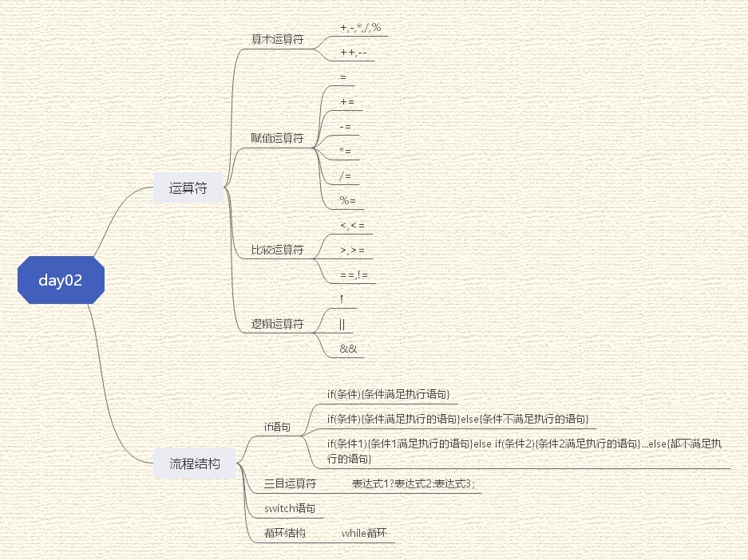

# 3 运算符

作用：用于执行代码的运算

| 运算符类型 | 作用                                   |
| ---------- | -------------------------------------- |
| 算术运算符 | 用于处理四则运算                       |
| 赋值运算符 | 用于将表达式的值赋给变量               |
| 比较运算符 | 用于表达式的比较，并返回一个真值或价值 |
| 逻辑运算符 | 用于根据表达式的值返回真值或假值       |


## 3.1 算术运算符

作用：用于处理四则运算

算术运算符包括以下符号：

| 运算符 | 术语          | 示例     | 结果  |
| ------ | ------------- | -------- | ----- |
| +      | 正号\|加      | +3\|10+5 | 3\|15 |
| -      | 负号\|减      | -3\|10-7 | -3\|3 |
| *      | 乘            | 10*5     | 50    |
| /      | 除            | 10/5     | 2     |
| %      | 取摸（取余）  | 10%3     | 1     |
| ++     | 前置/后置递增 | ++a/a++  | a+1/a |
| --     | 前置/后置递减 | --a/a--  | a-1/a |

两个小数之间是不可以进行取模（取余）运算，只有整形变量可以取模运算

## 3.2 赋值运算符

作用：用于将表达式的值赋给变量

| 运算符 | 术语   | 示例      | 结果     |
| ------ | ------ | --------- | -------- |
| =      | 赋值   | a=2;b=3;  | a=2;b=3; |
| +=     | 加等于 | a=0;a+=2; | a=2;     |
| -=     | 减等于 | a=3;a-=2; | a=1;     |
| *=     | 乘等于 | a=2;a*=4; | a=8;     |
| /=     | 除等于 | a=4;a/=2; | a=2;     |
| %=     | 模等于 | a=3;a%2;  | a=1;     |


## 3.3 比较运算符

作用：用于表达式的比较，并返回一个真值或假值

| 运算符 | 术语     | 示例 | 结果 |
| ------ | -------- | ---- | ---- |
| ==     | 相等于   | 4==3 | 0    |
| !=     | 不等于   | 4!=3 | 1    |
| <      | 小于     | 4<3  | 0    |
| >      | 大于     | 4>3  | 1    |
| <=     | 小于等于 | 4<=3 | 0    |
| >=     | 大于等于 | 4>=3 | 1    |

在使用`cout <<(a==b)<<endl;`时，必须加括号

## 3.4 逻辑运算符

作用：用于根据表达式的值返回真值或假值

| 运算符 | 术语 | 示例     | 结果                                                   |
| ------ | ---- | -------- | ------------------------------------------------------ |
| !      | 非   | !a       | 如果a为假，则a为真；如果a为真，则a为假。               |
| &&     | 与   | a&&b     | 如果a和b都为真，则结果为真，否则为假。                 |
| \|\|   | 或   | a \|\| b | 如果a和b有一个为真，则结果为真，二者都为假，结果为假。 |

# 4 程序流程结构

C/C++支持最基本的三种程序运行结构：顺序结构、选择结构、循环结构

- 顺序结构：程序按顺序执行，不发生跳转
- 选择结构：依据条件是否满足，有选择的执行相应的功能
- 循环结构：依据条件是否满足，循环多次执行某段代码

## 4.1 选择结构

### 4.1.1 if语句

作用：执行满足条件的语句

if语句的三种形式:

- 单行格式if语句

  `if(条件){条件满足执行语句}`

- 多行格式if语句

  `if(条件){条件满足执行的语句}else{条件不满足执行的语句}`

- 多条件的if语句

  `if(条件1){条件1满足执行的语句}else if(条件2){条件2满足执行的语句}...else{都不满足执行的语句}`

**嵌套if语句**：在if语句中，可以嵌套使用if语句，达到更精确的条件判断

### 4.1.2  三目运算符

作用：通过三目运算符实现简单的判断

语法：`表达式1?表达式2:表达式3;`

解释：如果表达式1为真，执行表达式2，并返回表达式2的结果；

如果表达式1为假，执行表达式3，并返回表达式3的结果；

### 4.1.3 switch语句

作用：执行多条分支语句

语法：

```C++
switch(表达式)
{
    case 结果1:执行语句;
        break;
     case 结果2:执行语句;
        break;
     ...
     default:执行语句;
        break;
}
```

if和switch区别？
switch缺点，判断时候只能是整型或者字符型，不可以是一个区间

switch有点，结构清晰，执行效率高

case里如果没有break，那么程序会一直向下执行

## 4.2 循环结构

### 4.2.1 while循环语句

作用：满足循环条件，执行循环语句

语法：`while(循环条件){循环语句}`

解释：只要循环的结果为真，就执行循环语句

在执行循环语句时，程序必须提供跳出循环的出口，否则出现死循环

**while循环练习案例：猜数字**

案列描述：系统随机生成一个1到100之间的数字，玩家进行猜测，如果猜错，提示玩家数字过大或过小，如果猜对恭喜玩家胜利，并退出游戏。

```C++
#include <iostream>
using namespace std;
#include <ctime>
int main()
{
	//添加随机数种子，作用利用当前系统时间生成随机数，防止每次随机数一样
	srand((unsigned int)time(NULL));

	//1.系统产生随机数
	int num = 0;
	num = rand() % 100 + 1;
	while (1)
	{
		//2.玩家进行猜测
		int val = 0;
		cin >> val;
		//3.判断玩家猜测
		//猜对 退出游戏
		//猜错 提示猜的结果 过大或过小
		if (val > num)
		{
			cout << "猜测过大" << endl;
		}
		else if (val < num)
		{
			cout << "猜测过小" << endl;
		}
		else
		{
			cout << "恭喜你猜对了" << endl;
			break;//用来退出当前循环
		}
	}
	system("pause");
	return 0;
}
```


思维导图：

代码地址：