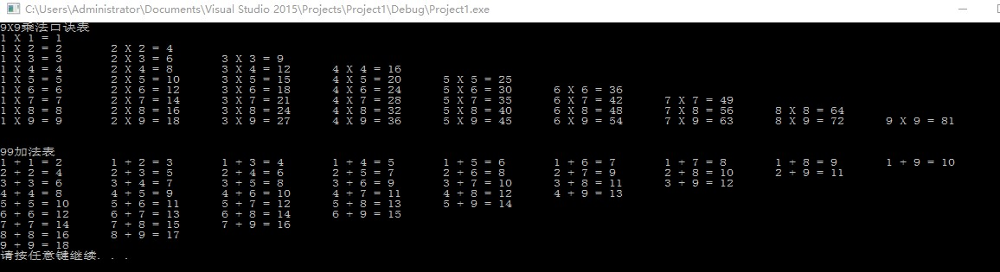
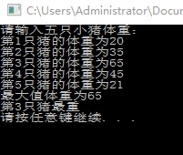

### 4.2.2 do ...while循环语句

作用：满足循环条件，执行循环语句

语法：`do{循环语句}while(循环条件);`

注意：与while的区别在于do...while会先执行一次循环语句，再判断循环条件

练习案例：水仙花数

水仙花数是指一个三位数，它的每个位上的数字的3次幂之和等于它本身，请利用do...while语句，求出所有3位数字中的水仙花数。

```c++
#include <iostream>
using namespace std;
#include <cmath>

int main()
{
	int num = 100;
	int a = 0;
	int b = 0;
	int c = 0;
	int sum = 0;
	cout << "水仙花数有：" << endl;
	do 
	{
		a = num % 10;
		b = num / 10 % 10;
		c = num / 100;
		sum = a*a*a + b*b*b + c*c*c;
		if (sum == num)
		{
			cout << num << endl;
		}
		num++;
	} while (num <= 999);
	system("pause");
	return 0;
}
```

结果：

### 4.2.3 for循环语句

作用：满足循环条件，执行循环语句

语法：`for(起始表达式;条件表达式;末尾循环体){循环语句;}`

练习案例：敲桌子

案列描述：从1开始数到数字100，如果数字个位含有7，或者数字十位含有7，或者该数字是7的倍数，我们打印敲桌子，其余数字直接打印输出。

```c++
#include <iostream>
using namespace std;
#include <cmath>

int main()
{
	for (int i = 1; i <= 100; i++)
	{
		if (i % 10 == 7 || i / 10 == 7 || i % 7 == 0)
		{
			cout << "敲桌子" << endl;
		}
		else
		{
			cout << i << endl;
		}
	}
	system("pause");
	return 0;
}
```

结果：

### 4.2.3 嵌套循环

作用：在循环体中再嵌套一层循环，解决一些实际问题

案例：99乘法口诀表

```C++
#include <iostream>
using namespace std;

int main()
{
	cout << "9X9乘法口诀表" << endl;
	for (int i = 1; i < 10; i++)
	{
		for (int j = 1; j <= i; j++)
		{
			cout << j << " X " << i << " = " << i*j<<"\t" ;
		}
		cout << endl;
	}
	cout << endl;
	cout << endl;
	cout << "99加法表" << endl;
	for (int i = 1; i < 10; i++)
	{
		for (int j = i; j <10; j++)
		{
			cout << i << " + " << j << " = " << i+j << "\t";
		}
		cout << endl;
	}
	system("pause");
	return 0;
}
```

结果：

## 4.3 跳转语句

### 4.3.1 break语句

作用：用于跳出选择结构或者循环结构

break使用时机：

- 出现switch条件语句中，作用是终止case并跳出switch
- 出现循环语句中，作用是跳出当前的循环语句
- 出现在嵌套语句中，跳出最近的内存循环语句

### 4.3.2 continue语句

作用：在循环语句中，跳过本次循环中余下尚未执行的语句，继续执行下一次循环

continue并没有使整个循环终止，而break会跳出循环

### 4.3.3 goto语句

作用：可以无条件跳转语句

语法：`goto 标记;`

解释：如果标记的名称存在，执行到goto语句时，会跳转到标记的位置。

在程序中不建议使用goto语句，以免造成程序流程混乱

# 5. 数组

## 5.1 概述

所谓数组，就是一个集合，里面存放了相同类型的数据元素

特点1：数组中的每个数据元素都是相同的数据类型

特点2：数组由连续的内村位置组成的

## 5.2 一维数组

### 5.2.1 一维数组定义方式

一维数组的三种定义方式：

1. `数据类型 数组名[数组长度];`

2. `数据类型 数组名[数组长度] = {值1，值2 ...}`

   如果在初始化数据的时候，没有全部填写完，会用0来填补剩余数据

3. `数据类型 数组名[] = {值1，值2 ...}`

数组元素的下标是从0开始索引的

### 5.2.2 一维数组组名

用途：

可以统计整个数组在内存中的长度

可以获取数组在内存中的首地址

数组名是一个常量，不可以进行赋值操作

练习案例：五只小猪称体重

案例描述：

在一个数组中记录了五只小猪的体重并打印最重的小猪体重

```C++
#include <iostream>
using namespace std;

int main()
{
	cout << "请输入五只小猪体重：" << endl;
	int arr[5];
	for (int i = 0; i < 5; i++)
	{
		cout << "第" << i+1 <<"只猪的体重为";
		cin >> arr[i];
	}
	int max = 0;
	int j = 0;
	int t = 0;
	for (j = 0; j < 5; j++)
	{
		
		if (arr[j] >= max)
		{
			max = arr[j];
			t = j + 1;
		}
	
	}
	cout << "最大值体重为"<< max << endl;
	cout << "第" << t << "只猪最重" << endl;
	system("pause");
	return 0;
}
```

结果：



案例2：数组元素逆置

案例描述：请声明一个5个元素的数组，并且将元素逆置。


```C++
#include <iostream>
using namespace std;

int main()
{
	//1.创建数组元素逆置
	int arr[5] = {};
	cout << "输入数组元素" << endl;
	for (int k = 0; k < 5; k++)
	{
		cout << "第" << k << "个元素为:";
		cin >> arr[k];
	}
	cout << "转换前的顺序为：";
	for (int i = 0; i < 5; i++)
	{
		cout << arr[i] << " ";
	}
	cout << endl;
	//2.实现逆置
	int start = 0;//起始元素下标
	int end = sizeof(arr) / sizeof(arr[0]) - 1;//结束下标
	while (start < end) 
	{
		int temp = arr[start];
		arr[start] = arr[end];
		arr[end] = temp;
		start++;
		end--;
	}
	//3.打印逆置后的数组
	cout << "转换后的顺序为：";
	for (int j = 0; j < 5; j++)
	{
		cout << arr[j] << " ";
	}
	cout << endl;
	
	system("pause");
	return 0;
}
```

案列结果：


### 5.2.3 冒泡排序

作用：最常用的排序算法，对数组内元素进行排序

1. 比较相邻的元素。如果第一个比第二个大，就交换它们。
2. 对每一对相邻的元素做同样的工作，执行完毕后，找到一个最大值
3. 重复以上步骤，每次比较次数-1，直到不需要比较


## 5.3 二维数组

二维数组就是在一维数组上，多加一个维度

### 5.3.1 二维数组定义方式

- `数据类型 数组名[行数][列数];`
- `数据类型 数组名[行数][列数] = {{数据1，数据2},{数据3,数据4}};`
- `数据类型 数组名[行数][列数] = {数据1，数据2,数据3,数据4};`
- `数据类型 数组名[][列数] = {数据1，数据2,数据3,数据4};`

利用第二种方式更加直观，提高代码可读性

在定义二维数组时，如果初始化了数据，可以省略行数

### 5.3.2 二维数组名

查看二维数组所占内存空间

获取二维数组首地址

### 5.3.3 二维数组应用案例

考试成绩统计：

案例描述：有三名同学（张三，李四，王五），在一次考试中的成绩分别如下表，请分别输出三名同学的总成绩

|      | 语文 | 数学 | 英语 |
| ---- | ---- | ---- | ---- |
| 张三 | 100  | 100  | 100  |
| 李四 | 90   | 50   | 100  |
| 王五 | 60   | 70   | 80   |

```C++
#include <iostream>
using namespace std;
#include <string>
int main()
{
	string names[3] = { "张三","李四","王五" };
	int score[3][3] = 
	{
		{100,100,100},
		{90,50,100},
		{60,70,80}
	};
	for (int i = 0; i < 3; i++)
	{
		int sum = 0;
		for (int j = 0; j < 3; j++)
		{
			sum += score[i][j];
		}
		cout << names[i] << "的总分：" << sum << endl;
	}
	system("pause");
	return 0;
}
```

结果：