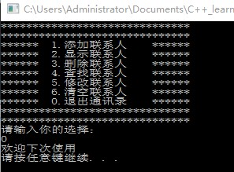
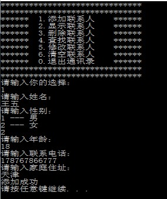

# 通讯录管理系统

## 1. 系统需求

通信录是一个可以记录亲人、好友信息的工具

本项目主要用C++来实现一个通讯录管理系统

系统中需要实现的功能如下：

- 添加联系人：向通讯录中添加新人，信息包括（姓名、性别、年龄、联系电话、家庭住址）最多纪录1000人
- 显示联系人：显示通讯录中所有联系人信息
- 删除联系人：按照姓名进行删除指定联系人
- 查找联系人：按照姓名查看指定联系人信息
- 修改联系人：按照姓名重新修改指定联系人
- 清空联系人：清空通讯录中所有信息
- 退出通信录：退出当前使用的通信录

## 2. 创建项目

## 3. 菜单功能

功能描述：用户选择功能的界面

步骤：

1. 封装函数显示该界面如`void showMenu()`
2. 在main函数中调用封装好的函数

```C++
void showMenu()
{
	cout << "******************************" << endl;
	cout << "******************************" << endl;
	cout << "******\t1.添加联系人\t******" << endl;
	cout << "******\t2.显示联系人\t******" << endl;
	cout << "******\t3.删除联系人\t******" << endl;
	cout << "******\t4.查找联系人\t******" << endl;
	cout << "******\t5.修改联系人\t******" << endl;
	cout << "******\t6.清空联系人\t******" << endl;
	cout << "******\t0.退出通讯录\t******" << endl;
	cout << "******************************" << endl;
	cout << "******************************" << endl;
}
```

效果：

## 4. 退出功能

功能描述：退出通讯录系统

思路：根据用户不同的选择，进入不同的功能，可以选择switch分支结构，将整个架构进行搭建

当用户选择0时候，执行退出，选择其他先不做操作，也不会退出程序

```C++
		case 0:
			cout << "欢迎下次使用" << endl;
			system("pause");
			return 0;
			break;
		}
```

结果：

## 5. 添加联系人

功能描述：

实现添加联系人功能，联系人上限为1000人，联系人信息包括（姓名、性别、年龄、联系电话、家庭住址）

添加联系人实现步骤：

1. 设计联系人结构体
2. 设计通讯录结构体
3. main函数中创建通讯录
4. 封装添加联系人函数
5. 测试添加联系人功能

### 5.1 设计联系人结构体

联系人信息包括：姓名、性别、年龄、联系电话、家庭住址

```C++
struct Person
{
	//姓名
	string m_Name;
	//性别 1 男 2 女
	int m_Sex;
	//年龄
	int m_Age;
	//电话
	string m_Phone;
};
```


### 5.2设计通讯录结构体

设计时候可以在通讯录结构体中，维护一个容量为1000的存放联系人的数组，并记录当前通讯录中联系人的数量

```C++
struct Addressboks
{
	//通讯录中保存的联系人数组
	struct Person personArray[MAX];
	//通讯录中当前记录联系人个数
	int m_Size;
};
```

### 5.3  main函数中创建通讯录

添加联系人函数封装好后，在main函数中创建一个通讯录变量，这个就是我们需要一直维护的通讯录

```C++
//创建通讯录结构体变量
	Addressboks abs;
	//初始化通讯录中人数为0个
	abs.m_Size = 0;
```

### 5.4 封装添加联系人函数

思路：添加联系人前先判断通讯录是否已满，未满情况将新建联系人信息逐个加入到通讯录

```C++
void addPerson(Addressboks * abs)
{
	//判断通讯录是否已满，如果满了就不要再添加
	if (abs->m_Size == MAX)
	{
		cout << "通讯录已满，无法添加！" << endl;
		return;
	}
	else
	{
		//添加联系人
		//姓名
		string name;
		cout << "请输入姓名： " << endl;
		cin >> name;
		abs->personArray[abs->m_Size].m_Name = name;
		//性别
		cout << "请输入性别： " << endl;
		cout << "1 --- 男" << endl;
		cout << "2 --- 女" << endl;
		int sex = 0;
		while (true)
		{
			cin >> sex;
			if (sex == 0 || sex == 1)
			{
				abs->personArray[abs->m_Size].m_Sex = sex;
				break;
			}
			cout << "输入有误，请重新输入" << endl;
		}
		//年龄
		int age = 0;
		cout << "请输入年龄： " << endl;
		cin >> age;
		abs->personArray[abs->m_Size].m_Age = age;
		//电话
		string phone;
		cout << "请输入联系电话： " << endl;
		cin >> phone;
		abs->personArray[abs->m_Size].m_Phone = phone;
		//住址
		string address;
		cout << "请输入家庭住址： " << endl;
		cin >> address;
		abs->personArray[abs->m_Size].m_Addr = address;
		abs->m_Size++;
		cout << "添加成功" << endl;
		//请按任意键继续
		system("pause");
		//清屏
		system("cls");
	}
}
```

### 5.5 测试添加联系人功能

选择界面中，如果玩家选择1，代表添加联系人，我们可以测试下该功能

在switch case语句中，case1里添加：

```C++
//添加联系人
case 1:
	addPerson(&abs);
    break;
```

## 6. 显示联系人

功能描述：显示通讯录已有的联系人信息

显示联系人实现步骤：

1. 封装显示联系人函数
2. 测试显示联系人功能

### 6.1 封装显示联系人函数

思路：判断如果当前通讯录中没有人员，就提示记录为空，人数大于0，显示通讯录中信息

```C++
void showPerson(Addressboks * abs)
{
	//判断通信录中人数是否为0，如果为0，提示记录为空
	//如果不为0，显示记录的联系人信息
	if (abs->m_Size == 0)
	{
		cout << "通讯录为空" << endl;
	}
	else
	{
		for (int i = 0; i < abs->m_Size; i++)
		{
			cout << "姓名： " << abs->personArray[i].m_Name << "\t";
			cout << "性别： " << (abs->personArray[i].m_Sex == 1 ?"男" : "女" )<< "\t";
			cout << "年龄： " << abs->personArray[i].m_Age << "\t";
			cout << "电话： " << abs->personArray[i].m_Phone << "\t";
			cout << "地址： " << abs->personArray[i].m_Addr << endl;
		}
	}
	system("pause");
	system("cls");
}
```

### 6.2 测试联系人功能

在switch case语句中，case2里添加

```C++
case 2:
	showPerson(&abs);
	break;
```

## 7. 删除联系人

功能描述：按照姓名进行删除指定联系人

删除联系人实现步骤：

1. 封装检测联系人是否存在
2. 封装删除联系人函数
3. 测试联系人功能

### 7.1 封装检测联系人是否存在

设计思路：

删除联系人之前，我们需要先判断用户输入的联系人是否存在，如果存在则删除，不存在提示用户没有要删除的联系人，因此我们可以把检测联系人是否存在封装成一个函数中，如果存在，返回联系人在通讯录中的位置，不存在返回-1

```C++
int isExist(Addressboks * abs,string name)
{
	for (int i = 0; i < abs->m_Size; i++)
	{
		if (abs->personArray[i].m_Name == name)
		{
			return i;
		}
	}
	return -1;
}
```

### 7.2 封装删除联系人函数

根据用户输入的联系人判断该通讯录中是否有此人

查找进行删除，并提示成功

查不到提示查无此人

```C++
void deletePerson(Addressboks * abs)
{
	cout << "请输入您要删除的联系人" << endl;
	string name;
	cin >> name;
	int ret = isExist(abs, name);
	if (ret == -1)
	{
		cout << "查无此人" << endl;
	}
	else
	{
		for (int i = ret; i < abs->m_Size; i++)
		{
			abs->personArray[i] = abs->personArray[i + 1];
		}

		abs->m_Size--;
		cout << "删除成功" << endl;
	}
	system("pause");
	system("cls");
}
```

## 8. 查找联系人

功能描述：按照姓名查看指定联系人信息

查找联系人实现步骤：

1. 封装查找联系人函数
2. 测试查找指定联系人

### 8.1 封装查找联系人函数

实现思路：判断用户指定的联系人是否存在，如果存在显示信息，不存在则提示查无此人

```C++
void findPerson(Addressboks * abs)
{
	cout << "请输入您要查找的联系人： " << endl;
	string name;
	cin >> name;
	//判断指定的联系人是否存在通讯录中
	int ret = isExist(abs, name);
	if (ret == -1)
	{
		cout << "查无此人" << endl;
	}
	else
	{
		cout << "姓名： " << abs->personArray[ret].m_Name << "\t";
		cout << "性别： " << (abs->personArray[ret].m_Sex == 1 ? "男" : "女") << "\t";
		cout << "年龄： " << abs->personArray[ret].m_Age << "\t";
		cout << "电话： " << abs->personArray[ret].m_Phone << "\t";
		cout << "地址： " << abs->personArray[ret].m_Addr << endl;
	}
	system("pause");
	system("cls");
}
```

### 8.2 测试查找联系人

在switch case语句中，case4里添加

```c++
case 4:
	findPerson(&abs);
	break;
```


## 9. 修改联系人

功能描述：按照姓名重新修改指定联系人

修改联系人指定步骤：

1. 封装修改联系人函数
2. 测试修改联系人功能

### 9.1 封装修改联系人函数

实现思路：查找用户输入的联系人，如果查找成功进行修改操作，查找失败显示查无此人

```C++
void modifyPerson(Addressboks * abs)
{
	cout << "请输入您要修改的联系人" << endl;
	string name;
	cin >> name;
	int ret = isExist(abs, name);
	if (ret == -1)
	{
		cout << "查无此人" << endl;
	}
	else
	{
		//姓名
		string name;
		cout << "请输入姓名： " << endl;
		cin >> name;
		abs->personArray[ret].m_Name = name;
		//性别
		int sex = 0;
		cout << "请输入您的性别： " << endl;
		cout << "1 --- 男" << endl;
		cout << "2 --- 女" << endl;
		while (true)
		{
			cin >> sex;
			if (sex == 1 || sex == 2)
			{
				abs->personArray[ret].m_Sex = sex;
				break;
			}
			cout << "输入有误，请重新输入" << endl;
		}
		//年龄
		int age = 0;
		cout << "请输入您的年龄： " << endl;
		cin >> age;
		abs->personArray[ret].m_Age = age;
		//电话
		cout << "请输入联系电话： " << endl;
		string phone;
		cin >> phone;
		abs->personArray[ret].m_Phone = phone;
		//住址
		cout << "请输入家庭住址： " << endl;
		string address;
		cin >> address;
		abs->personArray[ret].m_Addr = address;
		cout << "修改成功" << endl;
	}
	system("pause");
	system("cls");
}
```

### 9.3 测试修改联系人功能

在switch case语句中，case5里添加

```C++
case 5:
	modifyPerson(&abs);
	break;
```

## 10. 清空联系人

功能描述：清空通讯录中所有信息

清空联系人步骤

1. 封装清空联系人函数
2. 测试清空联系人

### 10.1 封装清空联系人函数

实现思路：将通讯录所有联系人信息清除掉，只要将2通讯录记录的联系人数量置为0，做逻辑清空即可。

```C++
void cleanPerson(Addressboks * abs)
{
	cout << "您的通讯录是否清空？(Y/N)" << endl;
	string select;
	cin >> select;
	while (true)
	{
		if (select == "Y" || select == "y")
		{
			//将当前记录联系人数量置为0，做逻辑清空操作
			abs->m_Size = 0;
			cout << "通讯录已清空" << endl;
		}
		else if (select == "N" || select == "n")
		{
			break;
		}
		else
		{
			cout << "输入有误" << endl;
			break;
		}
	}
	
	system("pause");
	system("cls");
}
```

### 10.2 测试清空联系人

在switch case语句中，case6里添加

```C++
case 6:
	cleanPerson(&abs);
	break;
```

部分结果测试：





贴上全部代码：

```C++
#include <iostream>
using namespace std;
#include <string>
#define MAX 1000

//设计联系人结构体
struct Person
{
	//姓名
	string m_Name;
	//性别 1 男 2 女
	int m_Sex;
	//年龄
	int m_Age;
	//电话
	string m_Phone;
	//住址
	string m_Addr;
};

//设计通讯录结构体
struct Addressboks
{
	//通讯录中保存的联系人数组
	struct Person personArray[MAX];
	//通讯录中当前记录联系人个数
	int m_Size;
};

//1.封装函数显示该界面
void showMenu()
{
	cout << "******************************" << endl;
	cout << "******************************" << endl;
	cout << "******\t1.添加联系人\t******" << endl;
	cout << "******\t2.显示联系人\t******" << endl;
	cout << "******\t3.删除联系人\t******" << endl;
	cout << "******\t4.查找联系人\t******" << endl;
	cout << "******\t5.修改联系人\t******" << endl;
	cout << "******\t6.清空联系人\t******" << endl;
	cout << "******\t0.退出通讯录\t******" << endl;
	cout << "******************************" << endl;
	cout << "******************************" << endl;
}

//2.添加联系人
void addPerson(Addressboks * abs)
{
	//判断通讯录是否已满，如果满了就不要再添加
	if (abs->m_Size == MAX)
	{
		cout << "通讯录已满，无法添加！" << endl;
		return;
	}
	else
	{
		//添加联系人
		//姓名
		string name;
		cout << "请输入姓名： " << endl;
		cin >> name;
		abs->personArray[abs->m_Size].m_Name = name;
		//性别
		cout << "请输入性别： " << endl;
		cout << "1 --- 男" << endl;
		cout << "2 --- 女" << endl;
		int sex = 0;
		while (true)
		{
			cin >> sex;
			if (sex == 1 || sex == 2)
			{
				abs->personArray[abs->m_Size].m_Sex = sex;
				break;
			}
			cout << "输入有误，请重新输入" << endl;
		}
		//年龄
		int age = 0;
		cout << "请输入年龄： " << endl;
		cin >> age;
		abs->personArray[abs->m_Size].m_Age = age;
		//电话
		string phone;
		cout << "请输入联系电话： " << endl;
		cin >> phone;
		abs->personArray[abs->m_Size].m_Phone = phone;
		//住址
		string address;
		cout << "请输入家庭住址： " << endl;
		cin >> address;
		abs->personArray[abs->m_Size].m_Addr = address;
		abs->m_Size++;
		cout << "添加成功" << endl;
		//请按任意键继续
		system("pause");
		//清屏
		system("cls");
	}
}

//3.显示联系人
void showPerson(Addressboks * abs)
{
	//判断通信录中人数是否为0，如果为0，提示记录为空
	//如果不为0，显示记录的联系人信息
	if (abs->m_Size == 0)
	{
		cout << "通讯录为空" << endl;
	}
	else
	{
		for (int i = 0; i < abs->m_Size; i++)
		{
			cout << "姓名： " << abs->personArray[i].m_Name << "\t";
			cout << "性别： " << (abs->personArray[i].m_Sex == 1 ?"男" : "女" )<< "\t";
			cout << "年龄： " << abs->personArray[i].m_Age << "\t";
			cout << "电话： " << abs->personArray[i].m_Phone << "\t";
			cout << "地址： " << abs->personArray[i].m_Addr << endl;
		}
	}
	system("pause");
	system("cls");
}

//4.检测联系人是否存在
int isExist(Addressboks * abs,string name)
{
	for (int i = 0; i < abs->m_Size; i++)
	{
		if (abs->personArray[i].m_Name == name)
		{
			return i;
		}
	}
	return -1;
}

//5.删除指定联系人
void deletePerson(Addressboks * abs)
{
	cout << "请输入您要删除的联系人" << endl;
	string name;
	cin >> name;
	int ret = isExist(abs, name);
	if (ret == -1)
	{
		cout << "查无此人" << endl;
	}
	else
	{
		for (int i = ret; i < abs->m_Size; i++)
		{
			abs->personArray[i] = abs->personArray[i + 1];
		}

		abs->m_Size--;
		cout << "删除成功" << endl;
	}
	system("pause");
	system("cls");
}

//6.查找指定的联系人信息
void findPerson(Addressboks * abs)
{
	cout << "请输入您要查找的联系人： " << endl;
	string name;
	cin >> name;
	//判断指定的联系人是否存在通讯录中
	int ret = isExist(abs, name);
	if (ret == -1)
	{
		cout << "查无此人" << endl;
	}
	else
	{
		cout << "姓名： " << abs->personArray[ret].m_Name << "\t";
		cout << "性别： " << (abs->personArray[ret].m_Sex == 1 ? "男" : "女") << "\t";
		cout << "年龄： " << abs->personArray[ret].m_Age << "\t";
		cout << "电话： " << abs->personArray[ret].m_Phone << "\t";
		cout << "地址： " << abs->personArray[ret].m_Addr << endl;
	}
	system("pause");
	system("cls");
}

//7.修改指定联系人信息
void modifyPerson(Addressboks * abs)
{
	cout << "请输入您要修改的联系人" << endl;
	string name;
	cin >> name;
	int ret = isExist(abs, name);
	if (ret == -1)
	{
		cout << "查无此人" << endl;
	}
	else
	{
		//姓名
		string name;
		cout << "请输入姓名： " << endl;
		cin >> name;
		abs->personArray[ret].m_Name = name;
		//性别
		int sex = 0;
		cout << "请输入您的性别： " << endl;
		cout << "1 --- 男" << endl;
		cout << "2 --- 女" << endl;
		while (true)
		{
			cin >> sex;
			if (sex == 1 || sex == 2)
			{
				abs->personArray[ret].m_Sex = sex;
				break;
			}
			cout << "输入有误，请重新输入" << endl;
		}
		//年龄
		int age = 0;
		cout << "请输入您的年龄： " << endl;
		cin >> age;
		abs->personArray[ret].m_Age = age;
		//电话
		cout << "请输入联系电话： " << endl;
		string phone;
		cin >> phone;
		abs->personArray[ret].m_Phone = phone;
		//住址
		cout << "请输入家庭住址： " << endl;
		string address;
		cin >> address;
		abs->personArray[ret].m_Addr = address;
		cout << "修改成功" << endl;
	}
	system("pause");
	system("cls");
}

//8.清空所有联系人
void cleanPerson(Addressboks * abs)
{
	cout << "您的通讯录是否清空？(Y/N)" << endl;
	string select;
	cin >> select;
	while (true)
	{
		if (select == "Y" || select == "y")
		{
			//将当前记录联系人数量置为0，做逻辑清空操作
			abs->m_Size = 0;
			cout << "通讯录已清空" << endl;
			break;
		}
		else if (select == "N" || select == "n")
		{
			break;
		}
		else
		{
			cout << "输入有误" << endl;
			break;
		}
	}
	
	system("pause");
	system("cls");
}


int main()
{
	//创建通讯录结构体变量
	Addressboks abs;
	//初始化通讯录中人数为0个
	abs.m_Size = 0;
	//创建用户选择输入的变量
	int select = 0;

	
	while (true)
	{
		//菜单调用
		showMenu();
		cout << "请输入你的选择： " << endl;
		cin >> select;
		switch (select)
		{
			//1.添加联系人
		case 1:
			//利用地址传递，可以修饰实参
			addPerson(&abs);
			break;
			//2.显示联系人
		case 2:
			showPerson(&abs);
			break;
			//3.删除联系人
		case 3:
		/*{
			cout << "请输入删除联系人姓名： " << endl;
			string name;
			cin >> name;
			if (isExist(&abs, name) == -1)
			{
				cout << "查无此人" << endl;
			}
			else
			{
				cout << "找到此人" << endl;
			}
			system("pause");
			system("cls");
		}*/
			deletePerson(&abs);
			break;
			//4.查找联系人
		case 4:
			findPerson(&abs);
			break;
			//修改联系人
		case 5:
			modifyPerson(&abs);
			break;
			//清空联系人
		case 6:
			cleanPerson(&abs);
			break;
			//退出通讯录
		case 0:
			cout << "欢迎下次使用" << endl;
			system("pause");
			return 0;
			break;
		}
	}
	system("pause");
	return 0;
}
```


这是学习b站上黑马程序员学习的。如有需要，可以去b站学习：

[黑马程序员匠心之作|C++教程从0到1入门编程,学习编程不再难](https://www.bilibili.com/video/av41559729/?p=84)

项目代码地址：[`**C-_learning**`](https://github.com/smallpotatody/C-_learning)当中的day06


